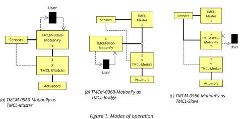

# Modes of operation

The MotionPy can be used in one of three different modes within a TMCL system.



When acting as a TMCL-Master, the MotionPy directly controls one or multiple TMCL-Modules, based on
user and sensor input.

When acting as a TMCL-Bridge, the MotionPy bridges between interfaces. By doing so,
it will act invisibly for TMCL-Masters and TMCL-Modules on the affected busses.
This can be used to forward and analyze TMCL-Commands sent over different bus systems.

When acting as a TMCL-Slave, the MotionPy itself can be controlled by external TMCL-Masters on one end,
hiding potentially complex application with multiple TMCL-Modules on the other end.
This way, abstract applications can be implemented on the TMCL-Master with the MotionPy
handling the individual TMCL-Modules.

Since the MotionPy is a general purpose platform, all of these modes have to be explicitly started via script or shell, or by adding
them to the `main.py` script. For all of these modes, there are several examples for
all kinds of configurations. Please take them for reference.

## TMCL-Master

The TMCL-Master functionality is already given by the `PyTrinamic` library
via the central `tmcl_interface`, handling all the requests and replies
when communicating with TMCL-Slaves.

Additionally, the module definitions of `PyTrinamic` can be used as a wrapper
when working with known modules. That way, setting and getting axis parameters as well as
rotating motors becomes a trivial task. Just wire up the TMCL-Module with the required
power and bus signal cables to the MotionPy, import and initialize the
required modules and feel free to control the module.

```Python
from PyTrinamic.modules.TMCM1270.TMCM_1270 import TMCM_1270
from PyTrinamicMicro.platforms.motionpy.connections.can_tmcl_interface import can_tmcl_interface

con = can_tmcl_interface()
module = TMCM_1270(con)

module.rotate(0, 1000)
time.sleep(5)
module.stop(0)

con.close()
```

## TMCL-Bridge

When using the MotionPy as a TMCL-Bridge, TMCL-Datagrams can be forwarded
between different bus systems, and even analyzed on the way. This makes the
MotionPy applicable as USB-to-X adapter and X-to-Y bus analyzer.
The following is a code snippet out of the USB-to-CAN example implementation.

```Python
def request_callback(request):
  global request_command
  request_command = request.command
  return request

def reply_callback(reply):
    if(request_command != TMCL.COMMANDS["GET_FIRMWARE_VERSION"]):
        reply.calculate_checksum()
    return reply

host = usb_vcp_tmcl_interface()
module = can_tmcl_interface()
bridge = TMCL_Bridge(host, [{"module":module, "request_callback":request_callback, "reply_callback":reply_callback}])

while(not(bridge.process(request_callback=request_callback, reply_callback=reply_callback))):
    pass
```

After initialization of the single interface towards the external TMCL-Master
and the probably multiple module interfaces (here it is just one),
`bridge.process(...)` is called periodically, handling and forwarding newly fetched
requests and replies to the correct destinations. In the intermediate steps, e.g.
when a new request comes in, additional actions can be taken in the callback function
defined in the main application (e.g. logging of the TMCL-Datagram).

## TMCL-Slave

As a third operational mode, the MotionPy can act as a single TMCL-Slave,
making additional modules of the next level transparent against external TMCL-Masters.
The following is a code snippet out of the TMCL-Slave example
implementation via USB.

```Python
con = usb_vcp_tmcl_interface()
slave = TMCL_Slave_Bridge(MODULE_ADDRESS, HOST_ADDRESS, VERSION_STRING, BUILD_VERSION)

while(not(slave.status.stop)):
    if(con.request_available()):
        request = con.receive_request()
        if(not(slave.filter(request))):
            continue
        reply = slave.handle_request(request)
        con.send_reply(reply)
```

The general workflow of the TMCL request handling is as follows:

1. Initialization of the used interface, the instance of the slave implementation
    and the used hardware.
2. If a TMCL-Request is available: Handle it in the TMCL-Slave implementation
  and return the answer. Parameters and status get updated during the procession
  in the TMCL-Slave.
3. Check the updated parameters and flags and take the corresponding actions.
4. Update all parameters from external sources.
5. Go to 2. Repeat until stop-flag is set.
6. Deinitialize used components and interfaces.

This loop and external module handling is supposed to be done in the main application.
Take the `tmcl_slave_usb` example script for reference.
The actual parameter handling is done in the TMCL-Slave implementation, which is generally a
descendant of the `TMCL_Slave` class. Therefore, please use `tmcl_slave_motionpy`
as a reference.
